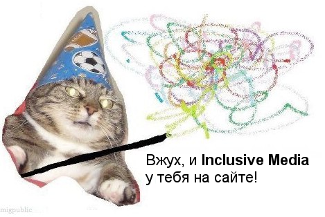

# bundle
Убийца Google Tag Manager, гроза морей и просто хороший парень - "связка модулей"!

Вжух, и у тебя на сайте наш восхитительный дополнительный функционал!



# Подключение
Для подключения необходимо узнать ID проекта, код которого будет внедрен на сайт (данную ссылку можно получить в [менеджере](https://uta-manager.ru))
```html
<script src='https://web.uta-manager.ru/bundle/:projectId' async></script>
```

## Атрибуты тега подключения
### disable-drupal-integration
Так получилось, Drupal Autodialog и наши формы не всегда понимают друг друга и могут портить друг другу жизнь.

Поэтому, если после внедрения нашего кода у вас сломался автодиалог, то можно отключить взаимодействие с ним (корректная работа форм не гарантируется)
указав в теге подключения флаг `disable-drupal-integration`
```html
<script src='https://web.uta-manager.ru/bundle/:projectId' async disable-drupal-integration></script>
```

### lang
Если необходимо задать фиксированный язык для компонентов, можно указать его в атрибуте `lang` (важно, чтобы для данного языка было описание у полей форм, а также описание ошибок)

На данный момент описания ошибок есть для: **ru**, **en**
```html
<script src='https://web.uta-manager.ru/bundle/:projectId' async lang="en"></script>
<!-- или -->
<script src='https://web.uta-manager.ru/bundle/:projectId' async lang="ru"></script>
```

### yaCounter
Если на странице установлено несколько счетчиков метрики, то события будут передаваться в каждый.

Если необходимо передавать события только в один счетчик метрики, его id можно указать в данном атрибуте.

```html
<script src='https://web.uta-manager.ru/bundle/:projectId' async yaCounter="3333333"></script>
```

### no-logo
Для скрытия ссылки на UTA-manager внизу форм с интерфейсом и панели обратного звонка, необходимо добавить флаг `no-logo`

```html
<script src='https://web.uta-manager.ru/bundle/:projectId' async no-logo></script>
```

# Модули
[Call Tracking](call-tracking.md)

[Формы с интерфейсом](forms/ui.md)

[Формы встраиваемые](forms/attach.md)

[Обратный звонок](callback.md)

[Виджет](widget.md)
